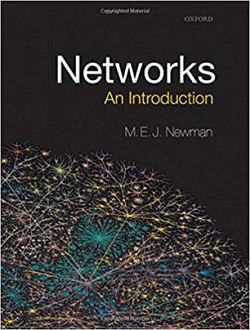
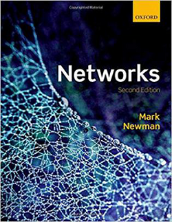
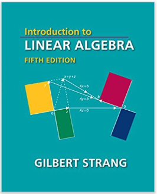

# 关于深度学习(DeepLearning)的思维直觉
## 所有的学习都是为了建立一种思维直觉

# 目录
1. [线性处理与非线性处理](#1)
2. [网络的普适性原理](#2)
3. [如何理解随机性](#3)
4. [如何理解反向传播](#4)
5. [如何从直觉上理解现今深度神经网络结构](#5)
6. [如何理解迁移学习](#6)
7. [深度网络面临的挑战与对策](#7)
8. [从数值计算的角度获得直觉](#8)
9. [数学的重要性](#9)
10. [智能与意识](#10)

<h2 id="1">1.线性处理与非线性处理</h2>
所谓线性处理是指输出信号是输入信号的常数倍，不改变信号的频谱，对信号进行放大或衰减（在多维信号的场景，输出信号是多维输入信号的线性组合）。例如听音乐时，我们希望无论音量大小，扬声器或耳机播放出来音乐都是高保真的，又例如我们使用传感器采集信号，无论输入信号的频率和幅度范围如何变化，总是希望输出信号是输入信号强度的固定倍数。除了用纯软件来实现，否则理想的线性系统是不存在的，工程技术对线性系统的追求永无止境。然而，仅有线性系统人们是造不出任何“智能”的系统，一个由线性电阻构建的网络，无论多复杂都只等效于一个电阻，线性神经网络无论多深多广都只等效于一层网络，不使用非线性元器件收音机无法从嘈杂的大气电波中“识别”出电台信号。再比如从信息处理的角度来理解，如果一个公司，所有员工都是线性单元，仅把自己收到的信息高保真的传递给同事和领导，而不敢或不允许对信息做非线性处理，所有决策（非线性处理）都有老板一个节点做出，那么显然这样的公司是不具备足够智能的。但反过来说，仅有非线性处理也是不友好的，否则大家听到的音乐可能都是变了调的。
我们可以简单的说，“智能”衍生自信号（信息）的线性处理与非线性处理。

<h2 id="2">2.网络的普适性原理</h2>
网络是上帝创造我们这个宇宙的本质规律之一，网络的存在就如同万有引力的存在一样稀松平常，平常的事物背后往往蕴含着最本质的规律，任何事物之间的联系都可以归纳于网络的范畴。一谈到网络人们通常联想到基于计算机的各层次网络，然而远在人类诞生之前网络就已经在作用于这个宇宙，推动地球生物的进化，并最终导致人类的诞生。李菲菲曾在多个场合用寒武纪物种大爆发举例，因为物种进化出了视觉，视觉使得生物个体远距离就能产生联系，极大的放大了网络的规模，加快了信息（信号）的传递速度，整个地球的生物圈就好比是上帝构建的一个深度网络，这个网络的优化指标是整个地球的“负熵”值与“智能”程度，在反向梯度传播的作用下，地球物种的智能程度逐步提高，地球环境也变得更为规律（负熵值增加）。
回顾生物进化史和人类发展史，就会发现网络的规模和结构对进化和发展起着决定性的作用。拿生物进化史举例，当地球生命以一大锅“原始汤”汤的形式存在于海洋之时，只有紧紧挨在一起的个体之间产生合作与竞争，生命之间的网络形式极为简单，信息传递和作用距离极为有限，所以早期生命的进化要以亿年为单位来测算。视觉诞生后，物种能够远距离感知猎物/捕猎者并发起攻击/逃逸，网络的规模和进化速度（学习速度）得以加速，辅以各种随机因素的作用，导致物种大爆发。人类发展史也有类似的规律，人类从原始采集部落、到酋长国、到农业社会、工业社会、信息社会，人类的社交网络规模越来越大，分工越来越精细，网络的作用距离越来越遥远（例如你正使用的某件物品可能是由远在地球另一边的某个工人所生产的）。
回顾深度神经网络的发展历程，也具有某种类似性，即由最初的浅层小规模全连接网络发展至今变成深度的、大规模的、具有明确分工与协作的嵌套与级联大规模深度网络。
所有网络均受统一的本质规律约束，亚马逊上可以检索到几本讲网络原理的书。

       

作为深度学习领域的工程人员，系统性的学习网络原理，必定有助于建立对网络的思维直觉。

<h2 id="3">3.如何理解随机性</h2>
对大多数参加工作后就没再接触概率学的工程师来说，从“随机”出发构建出强大的网络是反直觉的，对于训练神经网络和基于网络生成内容依赖于随机数也是不容易理解，往往将其当成一股神秘的黑暗力量，进而在实践中要么不知如何下手，要么一通胡乱try-error。“随机”不是没有规律，也不是“任意”，事件的随机性都是服从某种概率分布的结果，随机性表现在单次事件的行为或结果，由于大多数人的记忆容量和推理深度有限，不容易通过观察一些列的随机事件表现发现其背后的概率分布规律。
随机性也是事物多样性和系统活力的原动力之一，没有小行星撞地球，恐龙也许不会灭绝，恐龙不灭绝现今的地球可能就跟人类没啥关系；台风袭击海岛，吹倒大树反而给适宜海岛生长的植物获得更大繁殖的机会。类似的，深度神经网络在训练过程中通过随机的dropout，损失函数+反向传播迫使网络更努力的抓住数据的概率分布而不是简单的拟合噪声。
自然环境总是有各种各样的随机源，而人造的系统（例如代码上没有bug的人工神经网络）往往缺失必要的随机源，相同的输入产生相同的输出，使得网络陷入一种对称状态，从信息论的角度看，对称状态的网络的熵较低（所有的神经元行为一致），因而不能衍生出足够的智能。
大学没学过概率或者已经还给了老师的软件工程师，想要构建对随机性的直觉理解，必须系统性的学习概率这门课程，否则即便是死记硬背记住了相关概念的文字内容和符号，实际工作中概率的本质规律会时不时冒出来发起挑战。

<h2 id="4">4.如何理解反向传播</h2>
一般来说，即便是不理解导数、偏导、梯度等概念，大多数工程师也很容易建立起对反向传播的直觉，这是因为人类在学习进化的过程中反复在使用这个方法，例如我们在学习驾驶的过程中，当发现汽车偏离了道路中心，就要向相反的方向打方向盘，偏离越大，反向转动的角度越大，努力使汽车总是处于道路中间（损失函数达到最小），新手一开始会让汽车在道路中线左右较大幅度摆动，随着学习的进步，摆动幅度越来越小。再比如经济网络中，某种商品稀缺（或过剩），则终端销售价格上涨（或下跌），这种价格变动会沿着供应链方向传播到各级供应链网络，导致各级原材料加上跟随上涨（或下跌）。
数学上的直觉可以这么近似理解，整个网络的每一层可以等效为有多个输入变量和多个输出变量的函数，上一层的输出是下一层的输入，直到最后一个输出层，那么第一层（输入层）某个变量的一个微小δ1变化，将会逐层经过每层的函数作用后在每层的输出上产生变化量δL，将预测值与实际值的差异d沿着相反的方向，与δL以及学习速度相乘，就得到了各层连接权重的更新量，也就实现了反向传播。也就是说向前传播引起的损失越大的路径，方向传播接受的惩罚（修理）量就越大。
反向传播的一大难点是学习速度的选择，笔者至今还未对之建立好数学直觉，也是深度学习被质疑的一个关键点之一，即数学上不可解释，也就是说给你数据和目标任务，你几行代码就建好了模型，那么你应该选择怎样的学习速度呢？现行的基本思路是读论文，参考同类任务的超参数，基于大师们公开的best practice，try-error。从经验主义的角度看，只要是同类任务被广泛的成功尝试过了，向经验学习不算是太坏的事，毕竟“从经验学习”是早期人类进步的核心方法。也许随着研究的持续发展，所有超参数的选择将都会得到数学解释上的支撑。

<h2 id="1">5.如何从直觉上理解现今深度神经网络结构</h2>
现今深度神经网络的两大核心结构CNN和RNN是上世纪80年代的产物，笔者在上完吴恩达deeplearing.ai的课程后再次重读Yan LeCun的经典论文Gradient-Based Learning Applied to Document Recognition时（十年前尝试读过，但没读懂），居然从论文中看出了Yolo的启发点！只是那个年代受限于算力和数据量的约束，没能逃离寒冬的命运，但大师就是大师，Yan LeCun在接受deeplearning.ai采访时就说到，他坚信他的方法是可行的，即便是在寒冬，他仍然坚持，直到这一波热潮（泡沫？）回归！
大致来说，深度神经网络按职责可分成三段，第一段是特征提取，第二段是线性变换（矩阵乘法），第三段是概率化，并基于概率计算损失。这三段职责是相对独立的，不同的任务可以复用相同的特征提取段。

第一段，特征提取。特征提取的直觉可以这么理解，原始数据对概念的表征是很低效的，具有很大的冗余度，或者说高级抽象概念隐含在原始数据中，例如一张照片，是猫还是人脸，从像素层面看它可能有640*480*3个字节，而从抽象概念上例如文字来看，它就是一个词，“猫”或“人脸”。特征提取的原理就是选择与输入数据特性相匹配的网络结构来萃取数据的特征，就好比手工作坊时代用筛子筛沙淘金一样，为什么用筛子而不是其它工具来淘金呢，因为筛子匹配了金子与沙子的特征差异。类似的，卷积模型匹配了图像的特征，而顺序模型匹配了自然语言的特征。
需要说明的是，图像的特征比较直观，很多论文（例如Network In Network arXiv:1312.4400）用图形直接将特征呈现了出来，使得人眼一看就能理解，然而文本的特征就不那么直观了，每个单词都受到一组概念（例如颜色、味道、性别……）的约束，这也就是为什么自然语言看是很随意，但随便挑些单词并不能组成合法句子的原因，与之对应的是互联网上存在数以亿记的自然语言句子，组成每个句子的每个单词的特征决定了它们组合在一起能成为句子，并且能表达更高级的抽象概念。可是要如何给每个单词设定/定义一组特征向量（例如颜色、味道、性别、尺寸……）呢？如果特征向量的维度较低，语言学家手工操作也许可行，Hinton大师的方法是Word Embedding技术，即给每个单词分配一个N（例如N=512）维特征向量，1万个单词就是一个N X 1万的超大特征向量矩阵，然后训练一个语法模型，输入一句话中的上下文单词让模型预测目标单词，这下不怕数据不够，互联网任你爬取，有趣的是训练这个模型的目的不是为了得到句子填空的功能，而是得到前面说的每个单词的特征向量。因此单词的特征决定了句子的组成，反过来给定句子提取单词的特征可以理解为是一种逆向工程。但是，提取出来的特征并不是与人认知的特征一一对应的，可以理解为算法提取的特征是人所理解的特征的线性组合，两者是数学上等效的（相当于三维空间中的物体，不会因为坐标轴的旋转而导致其尺寸和形状的变化，人脑要是能直接解N维矩阵就好了）。
总而言之，提取特征的网络结构是与数据本身的内在结构以及概率分布相关的（所谓的注意力机制也是利用类似的原理），特征可以逐级抽象，不同抽象层级的特征可以跨层合并形成综合特征以提高模型的性能。特征可以在不同的任务中复用，例如用于人脸比对的特征也可以用于判别人脸表情，用于目标分类的特征作为循环网络的输入可以实现看图说话。

第二段，线性变换，通常叫全连接层，数学上就是权重矩阵乘输入向量，例如W是权重矩阵，a是输入向量，Y是输出向量，则Y=W·a=U·Σ·VT·a，其中U和V是正交矩阵，Σ是对角矩阵（根据矩阵的特征值分解原理，任何一个矩阵都可以分解为U、Σ、V），U·Σ·VT·a在数学上可以这么理解，向量a本来是在标准正交坐标系中，左乘VT相当于把向量做了一个旋转，再左乘Σ相当于把有些轴拉长有些轴缩短，最后再左乘U等同于再把向量做一次旋转，这么做的目的是为了将向量的各分量尽可能落在分类器的各个轴上，也就是实现分类。举个直觉的例子，就好比三维空间中有一系列点排列成某种规则图形，但不是从任意视角都能看得出那个图形（例如一条线可能被看成一个点，一个面可能被看成一条线），得旋转坐标恰好在某个视角看出来是个特定的图形。多个全连接层之间可以用线性激活函数，也可以用非线性激活函数，但如果仅适用线性激活函数，则多个全连接层在数学上等效于一个全连接层。

第三段，概率化，并基于概率计算损失。对于整个训练集或每个mini batch，数据都有其实际概率分布p，以及预测结果的概率分布q，训练的目的就是尽可能使得预测结果的概率分布q与实际的概率分布p足够逼近，逻辑回归模型可以等效理解为二元分类模型，从而适用于这个解释。在信息论中，两个概率分布之间的距离称为K-L距离，数学公式表示为：
D(p||q) = Σp(x)log(p(x)/q(x))=Σp(x)log(p(x))-Σp(x)log(q(x))
对于给定的训练集，p(x)是已知的，因而Σp(x)log(p(x))是个常量，要最小化D(p||q)等同于最小化-Σp(x)log(q(x))，此项在机器学习的教材中通常被成为“交叉熵”（但Thomas M. Cover所著的《Elements of Information Theory》中并没有交叉熵的定义），也就是分类模型常用的损失函数的定义。
概率化的好处是数值被限定在[0,  1]，计算方便，人理解起来也比较直观。然而上述的网络第二段的最后一层激活输出不一定在[0,  1]范围内，可通过tanh和softmax等非线性函数将其压缩至[0,  1]范围内。
不是所有的模型都用交叉熵作为损失函数，例如yolo就非常特别，它首先将需要预测的参数全部转换为logistic regression问题，然后再计算各标签参数与预测参数输出值的加权L2距离。

<h2 id="6">6.如何理解迁移学习</h2>
在系统性学习深度学习之前，总以为深度神经网络模型动不动就几百万、上千万乃至上亿的参数，超大的模型没有海量的数据和强劲的算力支撑，是很难训练出有实用价值模型的，个人、小公司在深度学习上很难有所作为，包括在deeplearning.ai课程的早期，Andrew Ng提到迁移学习，笔者对其有效性仍将信将疑，等到课程进行到CNN和RNN模型后，神秘感消失，直觉就上来了！
迁移学习之所以有效是因为根据前述三段式来理解深度网络，那么网络浅层表征的是低级的、基础的特征，大型开源模型基于海量数据进行训练，而你的特定小任务的数据的低级的、基础的特征分布会被大型开源模型海量数据所覆盖，也就是说你可以复用开源的基于海量数据训练的模型的特征提取器，然后仅训练你自己的全连接段+概率层，而你的任务规模往往比开源模型的通用任务小得多，全连接段往往可以裁剪到与目标任务匹配，从而极大的降低了训练的算力需求，再辅以数据增强技术，很小的数据量就可以达到实用的效果。
笔者尝试用yolo做了一个定制化的识别任务。该任务要解决的问题是识别并定位垂直俯视视角拍摄的图片中的课桌桌面上的纸质文档。原生的yolo模型对于纸质对象基本不识别。笔者一共采集了60个样本，每个样本包含一张A3的纸+一张32开的纸+一张贴纸，基于yolo-tiny-v3模型，分别尝试了fine tune和 transfer learning两种学习方式，均取得了超预期的效果。60个样本能达到如下图所示的效果实感意外。相关数据和超参数配置文件可于https://github.com/PowerOfDream/yolo-transfer-demo 处查看。

<h2 id="7">7.深度网络面临的挑战与对策</h2>
### 7.1 挑战一：梯度消失/爆炸
所谓梯度，就是同一层网络各节点的输入或输出的差分值（导数）拼接成的向量，梯度消失/爆炸实质是梯度的分量数值经过网络传递后越来越小或越来越大，直觉上，梯度消失就好比多人玩隔墙传话的游戏，等到信息传递到最后一个人那里已经完全失真了，梯度爆炸好比唱卡拉OK，用话筒对着扬声器产生高音量、高频率的循环啸叫声（循环网络的确会发生这样的情况）。应对措施包括：1）让浅层网络走捷径直接连接到更深的网络，例如ResNet；2）配合mini batch在每一层网络输出使用batch normalize，将信号锁定在某个均值和某个偏差范围内；3）对每层的权重使用L1或L2正则化；4）梯度剪切，强制限定梯度在某个阈值之内。
### 7.2 挑战二：overfitting
overfitting的本质是模型大、数据少，模型把训练数据（包括噪声数据）给机械性的记忆住了而没有“抓住”数据的本质分布规律，形成了过度复杂且错误的决策平面，导致实际生产数据落入错误的决策平面，尤其是全连接层网络很容易导致overfitting。应对措施包括：1）增加数据量，没数据用增强的方法造数据，总之尽可能使训练集的数据特征分布与生产数据的特征分布一致；2）降低模型的复杂性，举个极端的例子，参数的数量大于训练集的数据量，模型还来不及泛化就已经记住所有的数据了，loss很快接近零网络也就没法学习了；3）使用dropout正则化，这个对初学者来说是比较反直觉的，可以尝试从数据的概率分布角度来理解，dropout的本质是给数据增加噪声，一个mini batch范围内，噪声在数据的真实分布正负范围内抖动，mini batch平均之后噪声的正负贡献互相抵消了，同时连带训练集中的噪声的影响也一并减弱了，从而达到了消除overfitting的效果。
### 7.3 挑战三：超参数选择的数学依据
这个是让很多初学者头痛的问题，你永远无法知道你的最优选超参数组合是什么！理想的情况是有一个评估工具，根据要求解问题的难度系数，使用工具对数据集进行扫描分析，直接给出最优超参数组合。在这样的工具被证实有效之前，似乎唯一能做的也就是参考大师的best practice，多读论文，用brute force的方式多尝试几组参数组合。对于训练过程中参数的变化趋势，一种可以尝试的方法是将参数的概率分布和统计特征可视化，对比已知最优的超参数组合与次优超参数组合的训练过程，识别出最优的参数的概率分布和统计特征变化趋势，从而在训练的中途辅助判断所选超参数是否合适，这是一个初略的想法，还未做尝试。

<h2 id="8">8.从数值计算的角度获得直觉</h2>
广义上讲，神经网络方法就是一种数值计算的近似求解法，跟牛顿法求方程的根、迭代算法求矩阵的特征值等方法大思路是一致的，只是计算的规模、数据的维度有数量级的差异，以及各类生成模型用概率分布增加了一点点失控效果。迭代法能奏效的本质是所运用的计算法则与数值的改变朝着特定的数学公式或数据的概率分布、数据的内在特征在方向前行，就好比从矿土中提炼稀有金属，你得先知道所要提炼的目标金属的物理和化学特性，然后通过一道道工序逐步提纯，直至得到想要得到的产出。不同的是，现代的冶金术每一步都有精确的计算、测量和产出，全程都在工程化的方法下受控，而当下的深度学习还不能做到全程受控可解释，一定程度上像是化学学科还不成熟的时代的炼金术，即在一定程度的失控下，通过使用大模型、大数据量实现小智能产出。

<h2 id="9">9.数学的重要性</h2>
虽然各种深度学习的框架已经提供了很好的抽象和API封装，程序员用很少的代码就能使用模型做inference，但如果要比较深度的掌握深度学习的应用，基本的数学素养是必须的，因为但凡涉及模型的修改就需要能读懂深度学习方面的论文和书籍，忽略数学符号的存在是难以读懂论文的，比如说要修改损失函数的某项因子的权重，见着数学符号就绕道走是没法完成任务的。如果想达到看懂论文并且成功复现，更是离不开数学，因为数学功底好的人（不用怀疑深度学习研究者们的数学基础）会因为欣赏数学的简洁、高效之美而大量使用之数学公式。一个工作了多年、且工作过程中较少接触数学的软件工程师，如果转型深度的深度学习，建议重修以下数学课程：
### 9.1 单变量微积分，与多变量微积分
要爱上级数与多项式，而不是害怕它们，掌握三角函数、对数函数、指数函数、累加累乘的转换，函数的凸凹相关性质，拥抱自然数e，理解欧拉公式差不多就到位了。掌握导数与偏导的级联，理解梯度的概念，能够理解雅克比矩阵差不多就到位了。此外还需要知道基于计算机的数值计算存在的精度陷阱与规避方法。
推荐学习MIT 18.01和MIT18.02 课堂实录视频：
https://www.youtube.com/playlist?list=PL590CCC2BC5AF3BC1
https://www.youtube.com/playlist?list=PL4C4C8A7D06566F38
### 9.2线性代数
程序员学线性代数首要的是从单变量思维转变为向量化思维，养成向量化思维习惯，建立向量线性组合的思维直觉，理解各种矩阵与矩阵、矩阵与向量之间的运算的意义内涵，不能死记硬背。掌握各种基础功能矩阵的功能与作用原理，掌握各种矩阵的分解。基于Ax=b方程，掌握行空间、列空间、零空间等级子空间概念，理解dimension与rank的区别，理解Ax=b的近似解过程与原理。最重要的是必须理解SVD分解的过程与意义，可以说掌握了Ax=b的求解和SVD分解，才算是基本理解了线性代数。推荐学习MIT 18.06课堂实录视频：https://www.youtube.com/playlist?list=PLE7DDD91010BC51F8
### 9.3）概率
相比微积分和线性代数，概率的难度要大得多，而且概率还会用到微积分与线性代数，概率难点主要在于对初学者来说它总是反直觉的。概念和公式比较多，基于同一个问题模式可以衍生出很多问题，但是从问题往回找模式往往很不容易。概率是如此的重要，以至于缺少概率基础，连对最基本的逻辑回归损失函数与交叉熵损失函数都难以建立思维直觉，更不要说理解NLP的各类模型了（NLP相关模型也是高度依赖线性代数的）。基本来说要掌握以下内容：条件概率、全概率、贝叶斯公式、随机变量、随机变量相关的函数和法则、各种典型概率分布的PMF/PDF/CDF公式与故事，必须理解内涵，死记硬背字面没任何意义。推荐学习Harvard  stat 110课堂实录视频：
https://www.youtube.com/playlist?list=PLLVplP8OIVc8EktkrD3Q8td0GmId7DjW0
需要再次强调的是以上推荐的Youtube视频均为世界顶级大学的一流教授的讲课课堂实录，如果你是一个多年工作经验的软件工程师，爱好深度学习，想跟上技术的潮流切换到对年龄不那么敏感的技术轨道上，这三门课程真的值得你花足够的代价去认真学习，相信我，在数学直觉的加持下，深度的学习深度学习将会是件充满乐趣的事情！
以上推荐的课程的同步教材如下：

https://www.amazon.com/Calculus-MindTap-Course-James-Stewart/dp/1285740629/ref=sr_1_3?s=books&ie=UTF8&qid=1534831148&sr=1-3&keywords=stewart+calculus&smid=ATVPDKIKX0DER&dpID=41gRZCzJXwL&preST=_SX218_BO1,204,203,200_QL40_&dpSrc=srch

https://www.amazon.com/Introduction-Linear-Algebra-Gilbert-Strang/dp/0980232775/ref=sr_1_1?ie=UTF8&qid=1534830862&sr=8-1&keywords=linear+algebra+gilbert+strang&dpID=41Qxd6fnlyL&preST=_SX218_BO1,204,203,200_QL40_&dpSrc=srch

https://www.amazon.com/Introduction-Probability-Chapman-Statistical-Science/dp/1466575573/ref=sr_1_1?s=books&ie=UTF8&qid=1534831100&sr=1-1&keywords=Joseph+Blitzstein&dpID=41uT0PYnFfL&preST=_SY291_BO1,204,203,200_QL40_&dpSrc=srch

     

<h2 id="10">10.智能与意识</h2>
一般来说，智能与意识的话题比较高深，往往会上升到哲学层面，大师级的人物才配说出个123来，笔者斗胆在这里分享一下个人的肤浅认识。

一个系统能否被称为智能系统是很难达成一致意见的，例如能够进行加减乘除的计算器算不算智能系统？程序员开发的应用软件算不算智能系统？鹦鹉学舌算不算智能系统？收音机播放电台节目算不算智能系统？聊天机器人对话算不算智能系统？……相信不同的人、不同的时代有不同的答案。有人会说软件系统不是智能系统，因为软件的每一步指令都是人编排好的，它只是软件工程师的智能成果；也有人会说收音机不知智能系统，因为电信号的每一步处理过程都是电子工程师设计出来的，它是电子工程师的智能成果；如果一个机器人被程序设定为“看到老人倾倒上前扶住他/她”，这个机器人是有智能还是无智能呢？如果机器人没有被设定为“看到老人倾倒上前扶住他/她”，而机器人自作主张的这样做了，相信很多人都会认为这样的机器人是有智能的，对吧？

人们似乎普遍有一个准则，即严格受控执行的系统都不算是智能系统，而存在一定自主失控行为的系统才可能被称为智能系统。记得第一次在TedX上看李菲菲展示“看图说话”的功能，当时很是震惊，认为这就是人工智能！等到我能明白其工作原理后内心就不再那么看了，因为我已经知道它不是那么的失控（或者说完全没有失控，看图说话系统所表现朱来的失控是受人为设定的概率分布所控制的），甚至没有一点点自主性。

前段时间有个与Yan Lecun同代的前辈转发了一篇UCLA朱松纯教授（统计学和计算机科学教授）去年在国内一次演讲的文字稿：
（https://mp.weixin.qq.com/s/-wSYLu-XvOrsST8_KEUa-Q）
内容超级长，陆陆续续读了一周才读完。他讲了一个故事，说科学家在日本观察到一群乌鸦，看到猴子用石头砸开坚果吃果仁，自己也想吃果仁，可是乌鸦搬不动石头，咋办呢？乌鸦观察到汽车从马路上经过会把果壳压开，可是等到乌鸦去马路上捡食果肉，总有汽车撞过来，然后乌鸦又观察到斑马线人行绿灯亮起来的时候，汽车就会停下来，于是乌鸦将坚果丢到斑马线上让汽车碾压，然后等人行绿灯亮了就飞下去捡食果肉，真是一群聪明的乌鸦！然后朱教授说这才是正真的智能，你们现在干的深度学习跟二十年前相比本质上没啥区别，用超大的模型+海量数据不停的在那里刷榜，根本就不是人工智能！ 真可谓一语中的:-)

朱教授主张的是将力学、统计学、计算机视觉、心理学、生物进化学等等多个学科综合起来，构建出真正的人工智能，真正的人工智能能够像上面故事中的乌鸦一样通过观察环境自主学习、自主推演。这个演讲文字稿通篇读下来能够感受到大学者的风范和视野的高度，指明了人工智能的大统一场理论。但我不认同朱教授对当下深度学习的“大模型+海量数据”方法的diss，因为谈到智能，一个不能忽视的因素是它是地球生物经过几十亿年缓慢进化而来的，没有鱼的智能，就没有猿的智能，没有猿的智能也就没有人的智能，正是因为漫长的进化过程将低阶智能Hardwired进大脑了才进化出高阶智能的，当下的深度学习可以类比为这个低阶智能的Hardwired过程，除了刷榜沽名钓誉者之外是无需diss的。

谈完智能谈意识，这个话题比智能更具有挑战，什么是意识？意识到底从何而来？动物有没有意识？问题怪吓人的！记得我大女儿五岁的时候，有一天早晨吃早餐，她突然对我说：“我刚吃了一勺稀饭，但我没有命令我吃稀饭，你也没命令我吃稀饭，我的手就是舀了一勺稀饭送到我嘴里，这是怎么回事？”，我回答说那是人的下意识动作，“那什么是意识？”……
恰好那段时间我在看KK的《失控》，于是开始认真思考关于意识的问题。

《失控》举例说医院的病人，眼睛被蒙上了，半夜环境非常安静，相当于视觉和听觉都暂停工作了，于是病人开始产生各种幻觉，大意就是说脱离了环境意识就会失控、消亡，这个故事深深的启发了我：

**产生意识的主体必须有种类多样和精度足够的传感器，这些传感器采集环境信号，信号经神经网络传递到大脑，大脑依据这些信号对主体所处环境进行实时仿真，当大脑内的仿真结果与大脑外的真实环境的差异低到一定程度，意识就产生了，意识让主体感知自我的存在！意识离不开环境，意识离不开多种类的高精度传感器，意识离不开强大的算力，意识还离不开进化过程中Hardwired进大脑的低阶智能。**

我已经找不到这个说法的出处了，可能是看过的某本书，Google了好多次没找到类似的说法，都怀疑是我自己原创的了:-) 我想，要造出人工意识，必须依据意识产生的机理来建造系统，系统必须有足够的Hardwired的低阶智能，必须有足够强大的算力，必须有传感器，设定的任务目标之一为仿真所处的环境，也许当一切就绪之时，机器就觉醒了！根据朱教授的人工智能大统一场论，难道人工智能和人工意识要通过相同的途径来求解？

结尾讨论一下动物有没有意识的问题，三个镜头：1）狗追着自己的尾巴转圈咬；2）猴子跑到镜子后面去看另外一只猴子在不在；3）猩猩照镜子看到镜子里的猩猩头上有朵花，然后用手去摸自己的头把花取下来。无用质疑，狗、猴、猩猩都是具有智能的动物，但显然猩猩的自我意识要强于狗和猴，也许在猩猩的内心有了“我”的概念。
